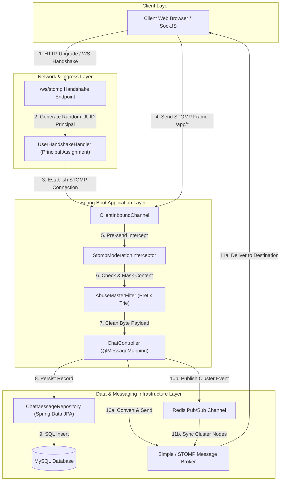
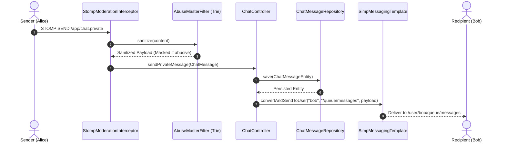
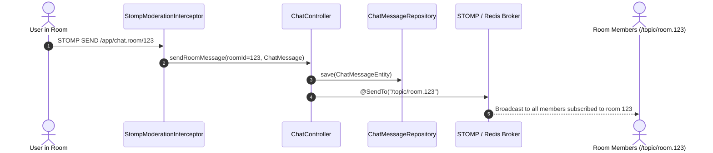
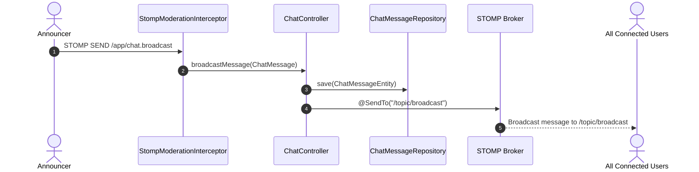
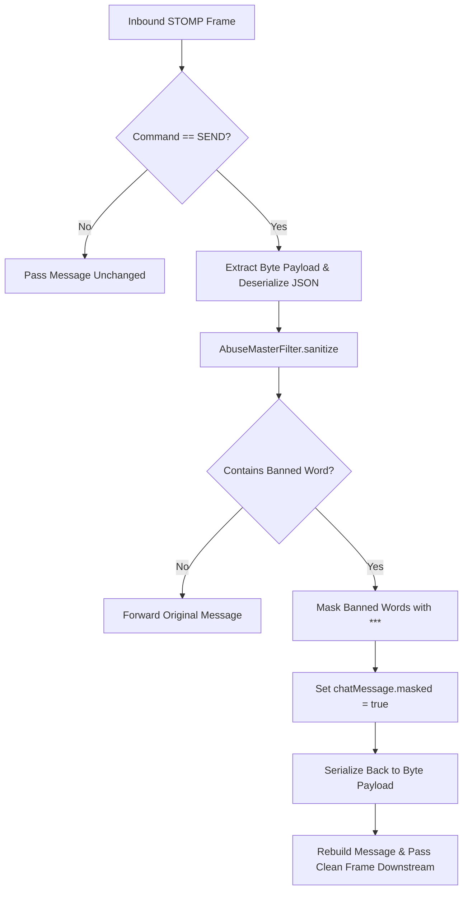

# Execution Flows

## 0. Full End-to-End System Request Architecture & Pipeline
**Trigger:** Client connects over WebSockets/SockJS, negotiates session identity, sends STOMP frames, passes profanity moderation, persists to MySQL, and scales across nodes via Redis.

### Full Request Pipeline Trace
1. **Connection & Authentication (Handshake):** Client initiates HTTP upgrade request to `/ws/stomp`. `UserHandshakeHandler.determineUser()` generates a unique session `Principal` (UUID username) and attaches it to the WebSocket session.
2. **Channel Ingress:** Client sends a STOMP frame to `/app/chat.private`, `/app/chat.room/{roomId}`, or `/app/chat.broadcast`. Frame enters Spring's `ClientInboundChannel`.
3. **Real-time Moderation Interception:** `StompModerationInterceptor.preSend()` catches the incoming frame before any controller mapping. `AbuseMasterFilter` checks text using a character Trie data structure and replaces abusive words with `***`.
4. **Controller Routing:** Modified clean frame moves to `@MessageMapping` handlers inside [ChatController](file:///Users/rkraj/Desktop/chat-message-app/src/main/java/com/example/chatmessageapp/controller/ChatController.java).
5. **Database Persistence:** `ChatMessageRepository.save()` translates the DTO to `ChatMessageEntity` and executes an INSERT into MySQL.
6. **Multi-Node Cluster Scaling & Broker Delivery:**
   - **Local Node:** Message is published to `/user/{username}/queue/messages` or `/topic/*` via `SimpMessagingTemplate`.
   - **Cluster Nodes:** `RedisPubSubService.publishToRedis()` broadcasts the payload across Redis Pub/Sub channels so other application server instances relay the message to their connected users.

---

## 1. 1-on-1 Direct Messaging (Private DM)
**Trigger:** Client sends STOMP frame to `/app/chat.private` with JSON body `{ "sender": "alice", "recipient": "bob", "content": "..." }`

**Trace:**
1. → `StompModerationInterceptor.preSend()` catches inbound STOMP `SEND` frame
2. → `AbuseMasterFilter.sanitize()` checks content using Trie algorithm and masks banned words with asterisks if present
3. → Modified/clean frame passes to `@MessageMapping("/chat.private")` in `ChatController.sendPrivateMessage()`
4. → `chatMessageRepository.save()` persists the message entity to MySQL database
5. → `messagingTemplate.convertAndSendToUser("bob", "/queue/messages", chatMessage)` routes message to recipient session

**Final effect:** Recipient ("bob") receives private message on `/user/bob/queue/messages`; message stored in DB.  
**Gotchas:** `UserHandshakeHandler` assigns a Principal username to each WebSocket session upon connect so `/user/{username}/queue/messages` routes correctly.

---

## 2. Group Room Messaging
**Trigger:** Client sends STOMP frame to `/app/chat.room/{roomId}` with JSON payload

**Trace:**
1. → `StompModerationInterceptor.preSend()` intercepts and sanitizes payload
2. → `ChatController.sendRoomMessage()` invoked with `@DestinationVariable String roomId`
3. → Room ID set on message object; `chatMessageRepository.save()` persists to MySQL
4. → `@SendTo("/topic/room.{roomId}")` broadcasts payload to simple broker / Redis pub-sub

**Final effect:** All clients subscribed to `/topic/room.{roomId}` receive real-time message.  
**Gotchas:** Redis Pub/Sub relay ensures multi-instance server synchronization for room topics across cluster nodes.

---

## 3. Broadcast Channel Messaging
**Trigger:** Client sends STOMP frame to `/app/chat.broadcast`

**Trace:**
1. → `StompModerationInterceptor.preSend()` validates and masks profane text
2. → `ChatController.broadcastMessage()` invoked
3. → `chatMessageRepository.save()` persists broadcast entry to MySQL
4. → `@SendTo("/topic/broadcast")` broadcasts message to all subscribers

**Final effect:** Every connected user subscribed to `/topic/broadcast` receives announcement.  
**Gotchas:** Heavy broadcast channels should rely on Redis/External broker in scaled environments.

---

## 4. Real-Time Moderation Interception (AbuseMasterFilter)
**Trigger:** Inbound STOMP `SEND` frame contains profane text matching prefix Trie dictionary

**Trace:**
1. → Inbound frame captured in `StompModerationInterceptor.preSend()`
2. → Payload deserialized to `ChatMessage`
3. → `AbuseMasterFilter` performs Aho-Corasick / Trie search over character array
4. → Profane tokens replaced with `***` and `chatMessage.setMasked(true)` set
5. → Clean payload re-serialized to byte array and returned via `MessageBuilder`

**Final effect:** Downstream controllers, DB persistence, and recipient subscriptions only receive sanitized clean content.  
**Gotchas:** Interception happens before controller mapping; harmful messages are purged at the ingress edge.

